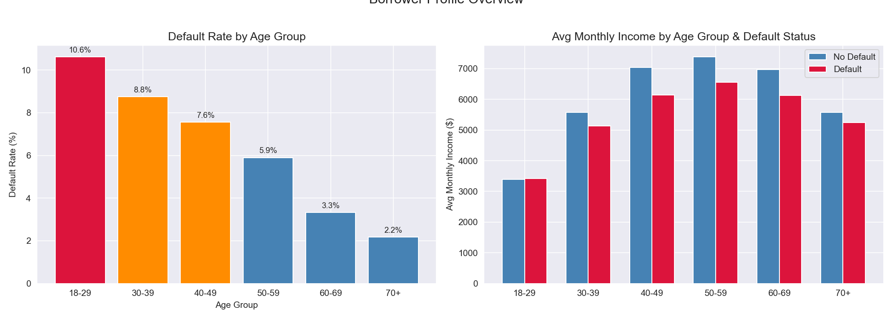
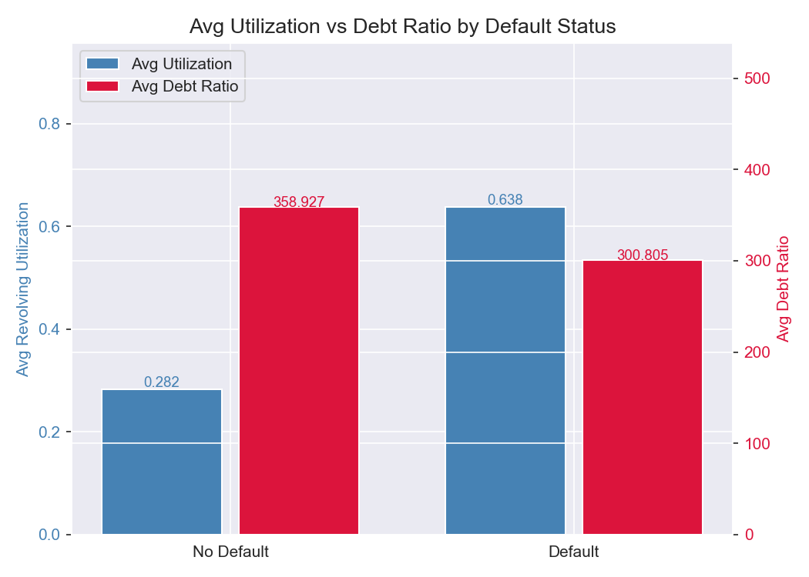
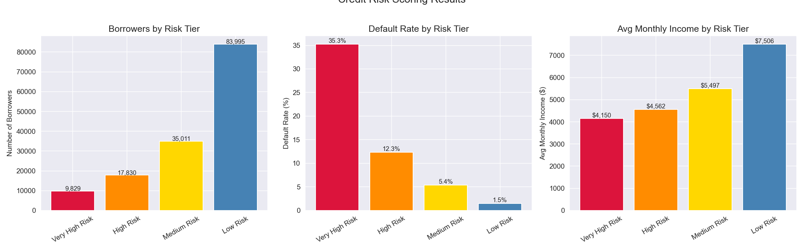
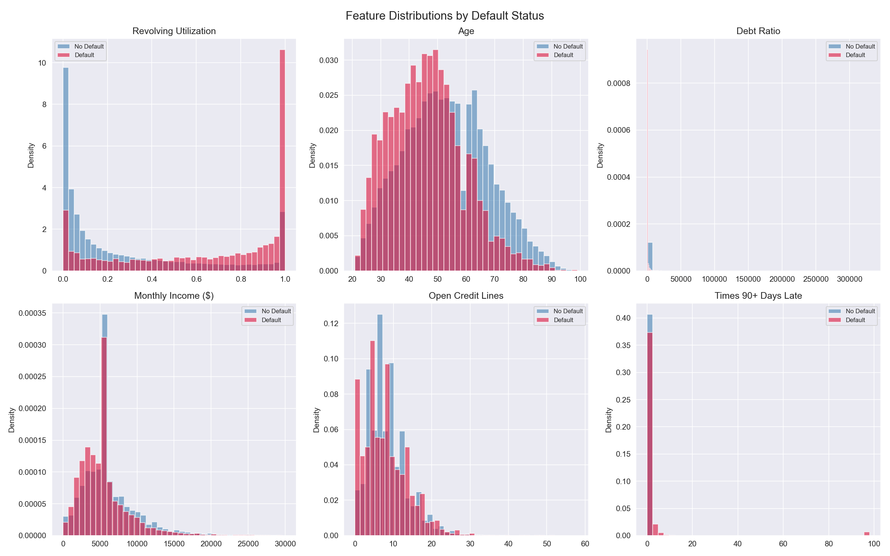
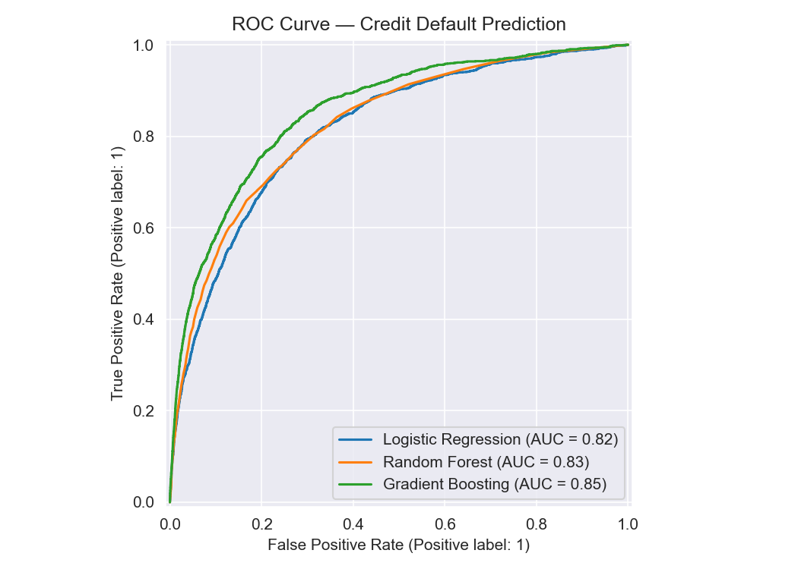
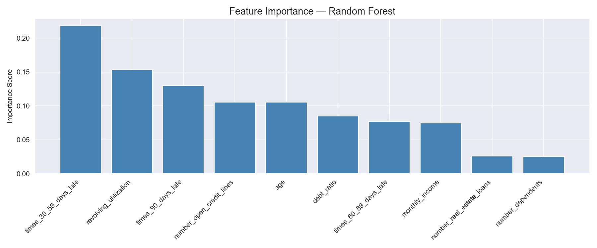
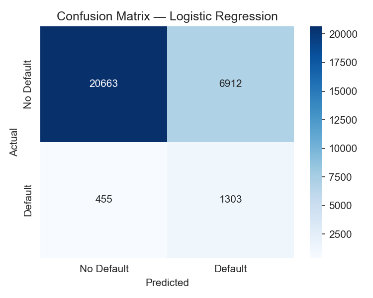
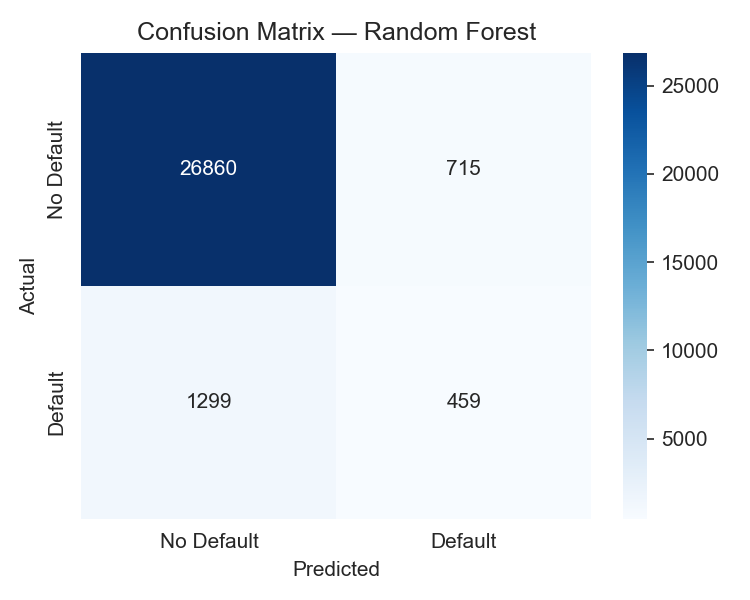
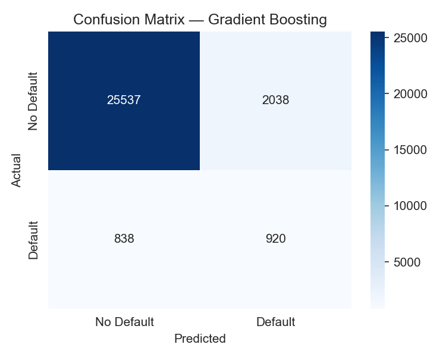

# Consumer Credit Risk Analysis — Credit Scoring & Default Prediction

A SQL and Python analysis of 146,665 U.S. consumer borrower records, building a rule-based credit scoring system and machine learning models to predict default probability using PostgreSQL, Python, and Scikit-learn.

---

## Problem Statement
Consumer credit risk is one of the most critical functions in retail banking and lending. Accurately identifying borrowers likely to default allows financial institutions to make smarter lending decisions, price risk appropriately, and maintain healthy loan portfolios. This project analyzes real-world borrower data to answer:
- Which borrower characteristics most strongly predict serious financial delinquency?
- Can a rule-based credit scoring system effectively stratify borrowers by default likelihood?
- How accurately can machine learning models predict default probability across 146,665 borrowers?

---

## Dataset
- **Source:** [Kaggle — Give Me Some Credit](https://www.kaggle.com/datasets/brycecf/give-me-some-credit-dataset)
- **Size:** 146,665 borrowers, 11 features
- **Overall Default Rate:** 5.99%
- **Database:** PostgreSQL (local)

---

## Tools & Libraries
- PostgreSQL, pgAdmin
- Python 3.x
- Pandas, NumPy
- Matplotlib, Seaborn
- Scikit-learn (Logistic Regression, Random Forest, Gradient Boosting)
- Imbalanced-learn (SMOTE)
- SQLAlchemy, psycopg2

---

## Project Workflow
1. Data ingestion — loaded CSV into PostgreSQL via Python, standardized column names to snake_case, imputed missing values for monthly income and number of dependents, removed extreme utilization outliers
2. SQL analysis — borrower profiling, default analysis by age group, rule-based credit scoring, window function risk ranking with deciles and cumulative defaults
3. Python visualization — feature distributions, delinquency analysis, risk tier charts, model evaluation
4. Predictive modeling — binary default classification using Logistic Regression, Random Forest, and Gradient Boosting with SMOTE oversampling and 5-fold cross-validation

---

## SQL Techniques Demonstrated
- Common Table Expressions (CTEs)
- Window Functions (RANK, NTILE, cumulative SUM OVER, rolling AVG OVER with ROWS BETWEEN)
- Multi-condition CASE WHEN for age grouping, income tiering, and risk scoring
- PARTITION BY for percentage calculations within groups
- NULLIF for safe division in default rate calculations
- SERIAL PRIMARY KEY for borrower identification

---

## Key Findings
- Overall default rate of **5.99%** across 146,665 borrowers — consistent with real-world consumer credit portfolios during non-recessionary periods
- Default rates decrease monotonically with age — from **10.63%** for borrowers aged 18-29 down to **2.18%** for borrowers 70+, a nearly 5x difference reflecting shorter credit histories and lower income stability among younger borrowers
- **Defaulters carry 2.3x higher revolving utilization** (0.638 vs 0.283) than non-defaulters — the single most actionable credit risk signal, consistent with FICO's 30% utilization weighting
- Rule-based credit scoring produced a **24x default rate difference** between Very High Risk (35.26%) and Low Risk (1.47%) tiers — validating the scoring framework's ability to stratify borrowers by meaningful default likelihood
- **Delinquency history dominates feature importance** — times_30_59_days_late (0.2181), revolving_utilization (0.1532), and times_90_days_late (0.1301) account for ~42% of total predictive power, consistent with FICO's payment history weighting
- **Gradient Boosting achieved the best overall performance** with ROC-AUC of 0.86 and the strongest precision-recall balance — recommended for production deployment
- **Random Forest showed significant overfitting** — CV ROC-AUC of 0.99 vs test ROC-AUC of 0.83 — requiring regularization before production use
- Counterintuitively, **defaulters carry lower average debt ratios** than non-defaulters (300.81 vs 358.93) — explained by older low-risk borrowers carrying large installment loans that inflate debt ratios without increasing default risk

---

## Visualizations

### Borrower Profile Overview

### Delinquency Analysis

### Credit Risk Scoring

### Feature Distributions by Default Status

### ROC Curve Comparison

### Feature Importance

### Confusion Matrices

---

## SQL Query Files
All queries are saved in the `sql/` folder:
- `01_create_table.sql` — schema creation with SERIAL PRIMARY KEY for borrower identification
- `02_borrower_summary.sql` — borrower demographics and financial profile by default status and age group
- `03_default_analysis.sql` — default rate and delinquency patterns by age group with ranking
- `04_credit_scoring.sql` — rule-based credit risk scoring with four-tier classification
- `05_window_functions.sql` — borrower risk ranking using RANK, NTILE deciles, and cumulative default tracking

---

## Limitations & Next Steps
- Monthly income and dependents required median imputation — missing data patterns may introduce bias
- Random Forest CV vs test ROC-AUC gap (0.99 vs 0.83) indicates overfitting — regularization warranted
- Rule-based thresholds manually defined — production system would use Weight of Evidence (WoE) and Information Value (IV) calibration
- Future work: probability calibration for loan pricing, WoE scorecard model, vintage analysis, bureau credit score integration

---

## How to Run This Project
1. Clone the repository
2. Install PostgreSQL and pgAdmin from [postgresql.org](https://postgresql.org)
3. Create a database called `credit_risk` in pgAdmin
4. Download `cs-training.csv` from [Kaggle](https://www.kaggle.com/datasets/brycecf/give-me-some-credit-dataset) and place it in the project root folder
5. Install Python dependencies: `pip install pandas numpy matplotlib seaborn scikit-learn imbalanced-learn sqlalchemy psycopg2-binary`
6. Open `credit_risk_analysis.ipynb` in Jupyter or VS Code
7. Update the database connection string with your PostgreSQL password
8. Run all cells — data loads automatically into PostgreSQL and all analysis runs end to end

---

## Repository Structure

---

## Author
**Mihrimah Qozat**
[LinkedIn](https://linkedin.com/in/mihrimah-qozat) |
[GitHub](https://github.com/mihrimahqozat)
